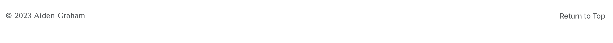

# portfolio-bootstrap-v
> Refactoring portfolio with Bootstrap 

# Intro
The aim of this project is to develop my existing portfolio site through supplementation of existing code with Bootstrap. Some additional components are added to the portfolio in line with project requirements such as a section on "skills" reflecting on what I have / hope to learn from the bootcamp I am currently enrolled upon.

### Pre-bootstrap portfolio site
My portfolio site prior to use of bootstrap can be viewed here: https://ag466.github.io/aidengraham-portfolio-fe-dev/

### Project aims
My project sought to refine some elements existing in the pre-bootstrap portfolio (such as the nav element) and to add additional features (such as a Jumbotron). The following is an outline of the brief set for my project:

1. Include navbar with links to sections of portfolio site
2. Inclusion of a Jumbotron
3. Inclusion of a "Work" section
4. Skills
5. Inclusion of a about / contact me section
6. Inclusion of a footer section
7. Site should adapt to various viewport sizes without reliance on media queries
8. Site should be deployed to GitPages.

The following sections will outline the accomplishment of project requirements implemented within my portfolio site.

# 1. Navbar
The navbar element of my portfolio site employs bootstrap. I have removed superfluous features by code deletion / commenting out. For example, because my site is currenlty a single page- I have for the time being elected to disable the search bar which was a feature of the bootstrap code I have used as the foundation for my navbar.

I have used my initials in the top left in place of a small logo / image as I liked having a title in my Navbar to ground my site. I feel the initials speak to a personal brand which is pivotal for a porfolio site.

There are four functional buttons in my nav which will direct users to the respectively named sections of my site. The buttons have a shadow effect on hover which reiterates their functionality and encourages user interaction. These points I consider to be positives in terms of an attempt to implement good UX design.

The nav bar implemented in this project is a significant step up in design terms from that which I was able to deploy in my original portfolio. For one, the nav bar made through use of bootstrap code is much sleaker and professional in appearance than the more crude nav exemplified in my non-bootstrap portfolio.

# 2. Jumbotron
The incorporation of a jumbotron is new for my portfolio. The jumbotron for my site displays my name and a brief statement about what users can find on my portfolio. 

I elected against displaying a background image of myself within the jumbotron as I felt it would compromise the general layout of the site in making the center too dominant in terms of content. My overarching aim was to try and utilise space in a logical manner by placing titles to the right and using the 2/3s of the screen to the left to house visual content. Such being the case my jumbotron looks as follows:

I bellieve the Jumbotron as used in my site is clean, informative and minimalistically stylish. It presents an image of myself as a design minded content / front end developer.

# 3. Work Section
The work section showcases my work to date. Being still in the early stages of my front end journey I have only a select few projects to display.

Currently the work section- which I have entitled "projects" looks as follows:

The images of my projects section are links which redirect users to deployed versions of the project where possible. The link to Grasko Handel redirects to my repository as the project is not currently deployed. I still used this as my main image as it is styilistically the best image and most interesting project I have available from my work to date.

All of the individual projects are contained within bootstrap cards. The cards link together images of the concerned project with a brief description.

# 4. Skills Section
The skills section is a new addition to my portfolio.

 
In the skills section I have detailed some skills I have gained so far from the bootcamp i.e. HTML and CSS. I have added a section about JavaScript to reflect on an upcoming element of the bootcamp I am excited to learn about. As the course develops I intend to update this section with new skills to showcase to employers my knowledge of front end design languages/frameworks.

The icons for the different skills come from the FontAwesome library.

# 5. Contact Section
To create my contact section I used a Bootstrap list.

Instead of text, I have used FontAwesome icons to convey the different means by which a visitor to my portfolio can contact me.
The hyperlinks all direct to their intended targets successfully. Whilst I could have incorporated the contact information into a footer, I decided that the information is more prominent within the main body of my site. For a portfolio site, where the main purpose is to provide visitors with an inisght into your work and a means to contact you- I felt the increased prominence was warranted.

# 6. Footer Section
I have used a very brief footer to provide information about my portfolio sites creation. 

The footer also contains a "Return to top" hyperlink which functions to take users back to the start of my page. 
This hyperlink has a hover effect enabled.

# 7. Viewport Adaptation

The site was developed first for small screens. The following is an image from a narrow viewport display:

The adaptation to smaller viewports from large and visa-versa has been achieved by use of the bootstrap grid layout and thus without any media queries.

Most sections will change from taking between 1/4 to 1/3 of screen width down to the full 12/12 of the column layout in small display.

On large displays, my profile image appears in the far right of the first row of the grid. This instantiation of the image is hidden on smaller screens and replaced by a image which only displays on small view ports. The above was a design based decision as the image on small screens felt as though it needed to be the first element following the nav bar, whilst on large displays it looked best as a counterweight to the images which are predominantly featured on the right hand portion of the site.

# 8. Deployment

The below is the link to the deployed portfolio site.

https://ag466.github.io/portfolio-bootstrap-v/

# 9. Notes on changes from pre-bootstrap site
The underlying structure and layout of my site remains substantially unchanged since its pre-bootstrap iteration.

I have however decided to change the aesthetics of the site in marked ways.

Point 1. Would be font and colour scheme choice.

I have decided to use a more minimalist aesthetic with a deep red accent and black / white background. This I feel is much more professional and in line with my personal brand.

In terms of font I have individualised my site by using a Google Font "Tenor Sans". I like the modern and contemporary feel this provides to my site. 